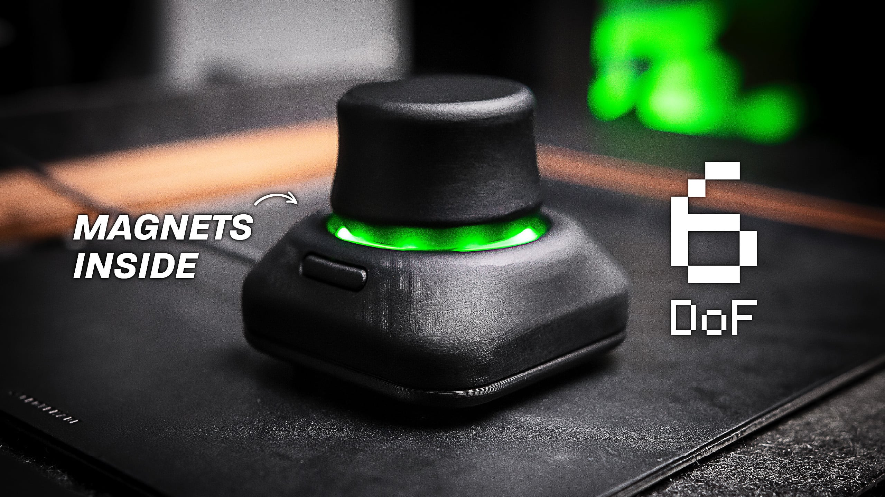

# CAD Mouse MK2

Watch the build video ↓

This is the second iteration of my DIY CAD Mouse, rebuilt to behave like a real 6DoF controller. There are still some motion processing issues, but it's much better than the previous version. It uses a custom PCB with three magnetic sensors, a 3D printed spring, and a redesigned enclosure that is smaller and easier to build.

Build instructions (coming soon)

⚠️ There have been several comments raising concerns about the longevity of the PETG spring. If it does not last as expected, a revision of the knob design will be needed.

[![CC BY-NC-SA 4.0][cc-by-nc-sa-shield]][cc-by-nc-sa]

[![CC BY-NC-SA 4.0][cc-by-nc-sa-image]][cc-by-nc-sa]

[cc-by-nc-sa]: http://creativecommons.org/licenses/by-nc-sa/4.0/
[cc-by-nc-sa-image]: https://licensebuttons.net/l/by-nc-sa/4.0/88x31.png
[cc-by-nc-sa-shield]: https://img.shields.io/badge/License-CC%20BY--NC--SA%204.0-lightgrey.svg